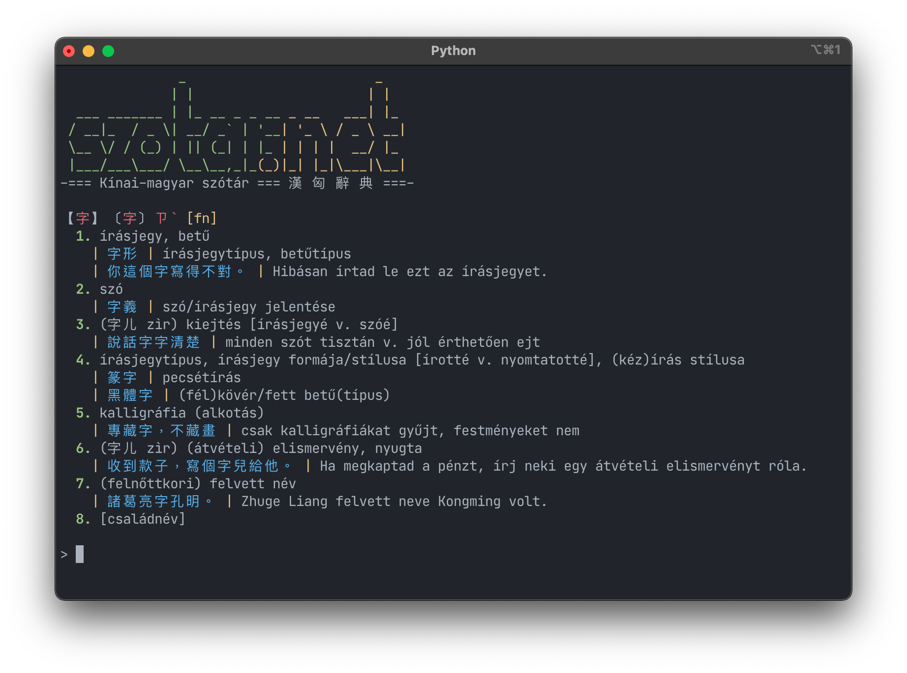

# szotar_net

szotar_net is a terminal-based client for the Chinese-Hungarian dictionary provided by Szotar.net. It adds some additional features, such as the option to display most Chinese text in Traditional characters, or to change the phonetic system to zhuyin. It is a work in progress, it's currently functional, though still needs a lot of refinement.

## Features
- Colourful interface for better readability
- Coloured headword characters/pronunciation based on tone
- Option to use Traditional characters for headwords and example sentences
- Option to use zhuyin as the phonetic system
- Many additional features coming later!

# DISCLAIMER
The name Szotar.net is the sole property of Akadémia Kiadó, and I am in no way affiliated with them. The contents of the dictionary are under copyright, and it is strictly forbidden to copy them or store them in any way. Before using this tool please read and understand the [Licence agreement](https://www.szotar.net/egyeb/licencszerzodes/) from Szotar.net and make sure you agree with it. 

This project is just a way to show my appreciation for the best Chinese-Hungarian dictionary ever made, and to make it accessible through the command line for geeks like myself. I have no intention whatsoever to make money from this, it is solely a personal project. It is only for personal use.
